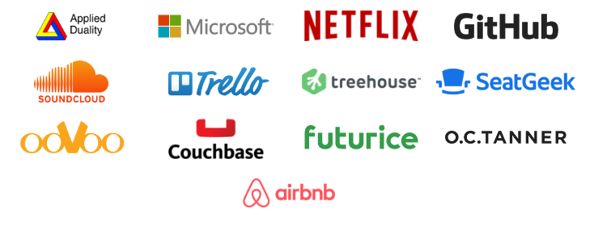

## RX-JAVA in Practice
<span style="font-family:Helvetica Neue; font-weight:bold">As a Knowledge Sharing session at <span style="color:#e49436">Networked Assets</span></span>
<br>
<span style="font-family:Helvetica Neue; font-weight:bold">By <span style="color:#e49436">JAROSŁAW WATRAL</span></span>


---

## What RxJava is
<span style="font-size:0.6em; color:gray">And what it isn't.</span>

+++


+++

>RxJava is a Java VM implementation of Reactive Extensions: a library for composing asynchronous and event-based programs by using observable sequences.

+++


+++

## Who uses RXJAVA?


---

## [OFFTOP] Will the name RXJAVA stay? ;-)

+++

## <a href="http://blog.vavr.io/javaslang-changes-name-to-vavr/" target="_blank">Sad story of JavaSlang</a>

+++

## Everything's working great - let's order some stickers!


+++

## But then "all the evil" happened

+++

## And the bad guys arrived

+++


+++

## The only sensible reaction...

+++


+++

## Fortunately, Engineers always find easy solutions 

+++


+++

## And that's how Vavr.io was born

+++

## Should we expect Rx Vavr?
<span style="font-size:0.6em; color:gray">Let's ask Oracle's Legal Department ;-)</span> <!-- .element: class="fragment" -->

---

## Story of Netflix
<span style="font-size:0.6em; color:gray">See <a href="https://medium.com/netflix-techblog/reactive-programming-in-the-netflix-api-with-rxjava-7811c3a1496a" target="_blank">this article</a> for details.</span>

+++

## Embrace Concurrency
Note:
Server-side concurrency is needed to effectively reduce network chattiness. Without concurrent execution on the server, a single “heavy” client request might not be much better than many “light” requests because each network request from a device naturally executes in parallel with other network requests. If the server-side execution of a collapsed “heavy” request does not achieve a similar level of parallel execution it may be slower than the multiple “light” requests even accounting for saved network latency.

+++

## Java Futures are Expensive to Compose
Note:
Java Futures are straight-forward to use for a single level of asynchronous execution but they start to add non-trivial complexity when they’re nested (prior to Java 8 CompletableFuture).
<br>
Conditional asynchronous execution flows become difficult to optimally compose (particularly as latencies of each request vary at runtime) using Futures. It can be done of course, but it quickly becomes complicated (and thus error prone) or prematurely blocks on ‘Future.get()’, eliminating the benefit of asynchronous execution.

+++

## Callbacks Have Their Own Problems
Note:
Callbacks offer a solution to the tendency to block on Future.get() by not allowing anything to block. They are naturally efficient because they execute when the response is ready.
Similar to Futures though, they are easy to use with a single level of asynchronous execution but become unwieldy with nested composition.

+++

## Some of the goals of Netflix were:
- Stay close to the original Rx.Net implementation while adjusting naming conventions and idioms to Java <!-- .element: class="fragment" -->
- All contracts of Rx should be the same <!-- .element: class="fragment" -->
- Target the JVM not a language. New language adapters can be contributed. <!-- .element: class="fragment" -->
- Support Java 6 (to include Android support) and higher with an eventual goal to target a build for Java 8 with its lambda support. (Update: Java 8 support was achieved without a separate build) <!-- .element: class="fragment" -->

+++

## Let's hear what they have to say:

+++

## VideoService example


+++

```Groovy
  getListOfLists(userId).mapMany({ VideoList list ->
    list.getVideos() // for each VideoList we want to fetch the videos
      .take(10) // we only want the first 10 of each list
      .flatMap({ Video video -> 
        def m = video.getMetadata().map({ // for each video we want to fetch metadata
          Map<String, String> md -> 
          return [title: md.get("title"), // transform to the data and format we want
              length: md.get("duration")]
        })
        def b = video.getBookmark(userId).map({ 
          position -> return [bookmark: position]
        })
        def r = video.getRating(userId).map({ 
          VideoRating rating -> 
          return [rating: 
            [actual: rating.getActualStarRating(),
             average: rating.getAverageStarRating(),
             predicted: rating.getPredictedStarRating()]]
        })
        return Observable.zip(m, b, r, {
                metadata, bookmark, rating -> 
            return [id: video.videoId] << metadata << bookmark << rating
        })
      })   
  })
```
Note:
/**
 * Demonstrate how Rx is used to compose Observables together
 * such as how a web service would to generate a JSON response.
 * 
 * The simulated methods for the metadata represent different 
 * services that are often backed by network calls.
 * 
 * This will return a sequence of dictionaries such as this:
 * 
 *  [id:1000, title:video-1000-title, length:5428, bookmark:0, 
 *    rating:[actual:4, average:3, predicted:0]]
 */


---

## Cool links
- 

## Markdown Slides
<span style="font-size:0.6em; color:gray">Press Down key for details.</span> |
<span style="font-size:0.6em; color:gray">See <a href="https://github.com/gitpitch/gitpitch/wiki/Slide-Markdown" target="_blank">GitPitch Wiki</a> for details.</span>


+++

#### Use GitHub Flavored Markdown
#### For Slide Content Creation

<br>

The same tool you use to create project **READMEs** and **Wikis** for your Git repos.

---

## Code Slides
<span style="font-size:0.6em; color:gray">Press Down key for examples.</span> |
<span style="font-size:0.6em; color:gray">See <a href="https://github.com/gitpitch/gitpitch/wiki/Code-Slides" target="_blank">GitPitch Wiki</a> for details.</span>

+++

#### Use Markdown Code Blocks

<br>

And enjoy code syntax highlighting for dozens of languages powered by <a target="_blank" href="highlight.js](https://highlightjs.org">highlight.js</a>.

+++

```JavaScript
// JavaScript Code Block

$('button').click(function(){
    $('h1, h2, p').addClass('blue')
    $('div').removeClass('important')
    $('h3').toggleClass('error')
    $('#foo').attr('alt', 'Lorem Ipsum')
});
```

+++

```Scala
// Scala Code Block

HashMap params = HashMap(n -> 10, mean -> 5)

// Define executable for R stats#rnorm function call.
OCPUTask task = OCPU.R()
                    .pkg("stats")
                    .function("rnorm")
                    .input(params.asJava)
                    .library()
```

+++

```Go
// Go Code Block

package main

import "fmt"

func swap(x, y string) (string, string) {
    return y, x
}

func main() {
    a, b := swap("hello", "world")
    fmt.Println(a, b)
}
```

---

## GIST Slides
<span style="font-size:0.6em; color:gray">Press Down key for examples.</span> |
<span style="font-size:0.6em; color:gray">See <a href="https://github.com/gitpitch/gitpitch/wiki/GIST-Slides" target="_blank">GitPitch Wiki</a> for details.</span>

+++

#### GitHub GIST
#### Building Blocks For Any Presentation

<br>

Enjoy 100% reusable code snippets, excellent syntax highlighting, code indentation and styling. 

+++?gist=8da53731fd54bab9d5c6

+++?gist=28ee3d19ddef9d51b15adbdfe9ed48da

---

## Image Slides
## [ Inline ]
<span style="font-size:0.6em; color:gray">Press Down key for examples.</span> |
<span style="font-size:0.6em; color:gray">See <a href="https://github.com/gitpitch/gitpitch/wiki/Image-Slides" target="_blank">GitPitch Wiki</a> for details.</span>

+++

#### Make A Visual Statement

<br>

Use inline images to lend a *visual punch* to your slideshow presentations.


+++

<span style="color:gray; font-size:0.7em">Inline Image at <b>Absolute URL</b></span>


<span style="color:gray; font-size: 0.5em;">the <b>Private Investocat</b> by <a href="https://github.com/jeejkang" target="_blank">jeejkang</a></span>


+++

<span style="color:gray; font-size:0.7em">Inline Image at GitHub Repo <b>Relative URL</b></span>


<span style="color:gray; font-size:0.5em">the <b>Octocat-De-Los-Muertos</b> by <a href="https://github.com/cameronmcefee" target="_blank">cameronmcefee</a></span>


+++

<span style="color:gray; font-size:0.7em"><b>Animated GIFs</b> Work Too!</span>


<span style="color:gray; font-size:0.5em">the <b>Daftpunktocat-Guy</b> by <a href="https://github.com/jeejkang" target="_blank">jeejkang</a></span>

---

## Image Slides
## [ Background ]
<span style="font-size:0.6em; color:gray">Press Down key for examples.</span> |
<span style="font-size:0.6em; color:gray">See <a href="https://github.com/gitpitch/gitpitch/wiki/Image-Slides#background" target="_blank">GitPitch Wiki</a> for details.</span>

+++

#### Make A Bold Visual Statement

<br>

Use high-resolution background images for maximum impact.

+++?image=https://d1z75bzl1vljy2.cloudfront.net/kitchen-sink/victory.jpg

+++?image=https://d1z75bzl1vljy2.cloudfront.net/kitchen-sink/127.jpg


---

## Video Slides
## [ Inline ]
<span style="font-size:0.6em; color:gray">Press Down key for examples.</span> |
<span style="font-size:0.6em; color:gray">See <a href="https://github.com/gitpitch/gitpitch/wiki/Video-Slides" target="_blank">GitPitch Wiki</a> for details.</span>

+++

#### Bring Your Presentations Alive

<br>

Embed *YouTube*, *Vimeo*, *MP4* and *WebM* inline on any slide.

+++


+++


+++


---

## Video Slides
## [ Background ]
<span style="font-size:0.6em; color:gray">Press Down key for examples.</span> |
<span style="font-size:0.6em; color:gray">See <a href="https://github.com/gitpitch/gitpitch/wiki/Video-Slides#background" target="_blank">GitPitch Wiki</a> for details.</span>

+++

#### Maximize The Viewer Experience

<br>

Go fullscreen with *MP4* and *WebM* videos.

+++?video=http://clips.vorwaerts-gmbh.de/big_buck_bunny.mp4

---

## Math Notation Slides
<span style="font-size:0.6em; color:gray">Press Down key for examples.</span> |
<span style="font-size:0.6em; color:gray">See <a href="https://github.com/gitpitch/gitpitch/wiki/Math-Notation-Slides" target="_blank">GitPitch Wiki</a> for details.</span>

+++


#### Beautiful Math Rendered Beautifully

<br>

Use *TeX*, *LaTeX* and *MathML* markup powered by <a target="_blank" href="https://www.mathjax.org/">MathJax</a>.

+++

`$$\sum_{i=0}^n i^2 = \frac{(n^2+n)(2n+1)}{6}$$`

+++

`\begin{align}
\dot{x} & = \sigma(y-x) \\
\dot{y} & = \rho x - y - xz \\
\dot{z} & = -\beta z + xy
\end{align}`

+++

##### The Cauchy-Schwarz Inequality

`\[
\left( \sum_{k=1}^n a_k b_k \right)^{\!\!2} \leq
 \left( \sum_{k=1}^n a_k^2 \right) \left( \sum_{k=1}^n b_k^2 \right)
\]`

+++

##### The probability of getting \(k\) heads when flipping \(n\) coins is:

`\[P(E) = {n \choose k} p^k (1-p)^{ n-k} \]`

+++

##### In-line Mathematics

This expression `\(\sqrt{3x-1}+(1+x)^2\)` is an example of an inline equation.

---

## Slide Fragments
<span style="font-size:0.6em; color:gray">Press Down key for examples.</span> |
<span style="font-size:0.6em; color:gray">See <a href="https://github.com/gitpitch/gitpitch/wiki/Fragment-Slides" target="_blank">GitPitch Wiki</a> for details.</span>

+++

#### Reveal Slide Concepts Piecemeal

<br>

Step through slide content in sequence to slowly reveal the bigger picture.

+++

- Java
- Groovy |
- Kotlin |
- Scala  |
- The JVM rocks! |

+++

<table>
  <tr>
    <th>Firstname</th>
    <th>Lastname</th> 
    <th>Age</th>
  </tr>
  <tr>
    <td>Jill</td>
    <td>Smith</td>
    <td>25</td>
  </tr>
  <tr class="fragment">
    <td>Eve</td>
    <td>Jackson</td>
    <td>94</td>
  </tr>
  <tr class="fragment">
    <td>John</td>
    <td>Doe</td>
    <td>43</td>
  </tr>
</table>

---
## <span style="text-transform: none">PITCHME.yaml</span> Settings
<span style="font-size:0.6em; color:gray">Press Down key for examples.</span> |
<span style="font-size:0.6em; color:gray">See <a href="https://github.com/gitpitch/gitpitch/wiki/Slideshow-Settings" target="_blank">GitPitch Wiki</a> for details.</span>

+++

#### Stamp Your Own Look and Feel

<br>

Set a default theme, custom logo, custom css, background image, and preferred code syntax highlighting style.

+++

#### Customize Slideshow Behavior

<br>

Enable auto-slide with custom slide intervals, presentation looping, and RTL flow.


---
## Slideshow Keyboard Controls
<span style="font-size:0.6em; color:gray">Press Down key for examples.</span> |
<span style="font-size:0.6em; color:gray">See <a href="https://github.com/gitpitch/gitpitch/wiki/Slideshow-Fullscreen-Mode" target="_blank">GitPitch Wiki</a> for details.</span>

+++

#### Try Out These Great Features Now!

<br>

| Mode | On Key | Off Key |
| ---- | :------: | :--------: |
| Fullscreen | F |  Esc |
| Overview | O |  O |
| Blackout | B |  B |
| Help | ? |  Esc |


---

## GitPitch Social
<span style="font-size:0.6em; color:gray">Press Down key for examples.</span> |
<span style="font-size:0.6em; color:gray">See <a href="https://github.com/gitpitch/gitpitch/wiki/Slideshow-GitHub-Badge" target="_blank">GitPitch Wiki</a> for details.</span>

+++

#### Slideshows Designed For Sharing

<br>

- View any slideshow at its public URL
- [Promote](https://github.com/gitpitch/gitpitch/wiki/Slideshow-GitHub-Badge) any slideshow using a GitHub badge
- [Embed](https://github.com/gitpitch/gitpitch/wiki/Slideshow-Embedding) any slideshow within a blog or website
- [Share](https://github.com/gitpitch/gitpitch/wiki/Slideshow-Sharing) any slideshow on Twitter, LinkedIn, etc
- [Print](https://github.com/gitpitch/gitpitch/wiki/Slideshow-Printing) any slideshow as a PDF document
- [Download and present](https://github.com/gitpitch/gitpitch/wiki/Slideshow-Offline) any slideshow offline

---

## GO FOR IT.
## JUST ADD <span style="color:#e49436; text-transform: none">PITCHME.md</span> ;)